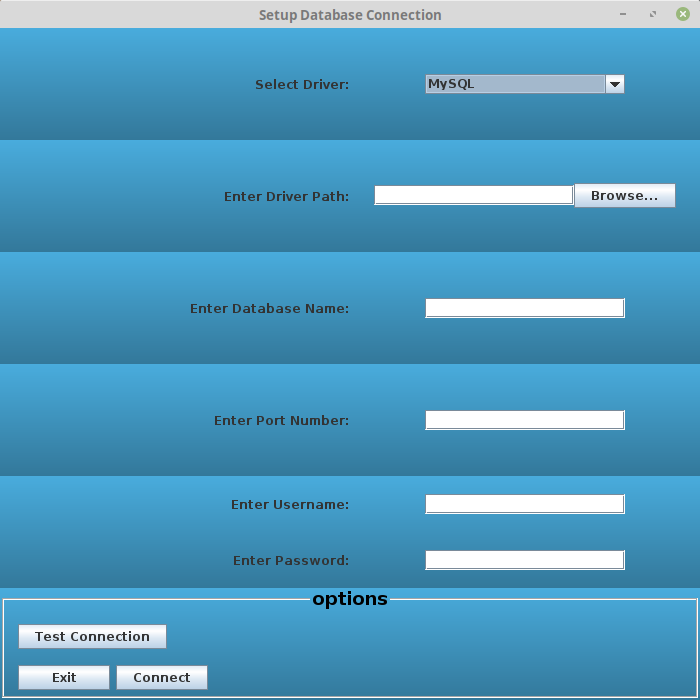
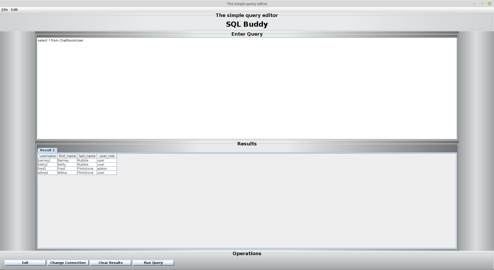

# sql-buddy

## Program Description

This Java Swing program adds to the basic abilities of the [simple-sql-window project](https://github.com/bryandaniel1/simple-sql-window). On startup, a setup window collects properties from user input for the database connection. The user is able to choose from multiple databases and select an appropriate driver during setup. Once tested, the connection properties are saved and used for queries executed from the query window. 

The query window gives the user options to execute multiple queries at once, clear results, change database connection, and exit the program. The new features in the menu bar include opening and saving files and selecting from a handful of different styling themes for the UI. The screenshots below show the program in action.

The database connection properties are collected in the setup window.

<figure>
  
  <figcaption>Figure1. Connection Properties Setup Window</figcaption>
</figure> 
 

SQL statements are executed from the query window.

<figure>
  
  <figcaption>Figure 2. Query Window</figcaption>
</figure> 
 
